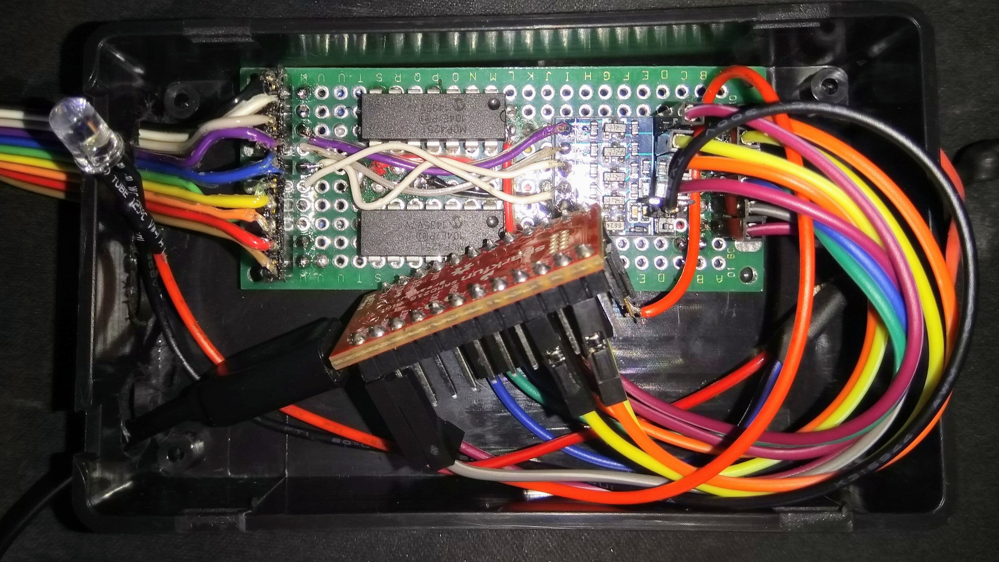


Usb => Gameport v0.1
=====================

Author: ChrisDeadman

Convert a USB HID device (joystick, gamepad) into a Gameport joystick with the power of arduino :-)

**Note**: This is obsolete and has been superseded by [usb-to-ps2-gameport-hat](https://github.com/ChrisDeadman/usb-to-ps2-gameport-hat).

## Notes
* Supports Xbox wireless receiver
* Watchdog timer is enabled and configured to 4sec
* You need to lower USB_XFER_TIMEOUT (e.g. to 1000) in **UsbCore.h** (part of the used platform library)  
  Usb.Task() may otherwise take longer than the watchdog's timeout and the chip will just reset over and over
* Diagnostic information is available via Serial1 @ 115200 8N1 (can be disabled in HIDDescriptionParser.h)
* Use an USB OTG cable to connect your device to the board
* SPI pins SCK(13) and SDO(11) are used to control two MCP4251 (2x dual digital potentiometer) for 4 axis
* Chip-select pins for both MCP4251 are set to pins 2 and 3 - can be changed in main.cpp
* Button pins are set to pins 4,5,6,7 - can be changed in main.cpp
* Don't forget that SAMD21 has 3.3V rated pins, so you should really use level-converters to avoid any damage

## (Known) Limitations
* The HID descriptor parsing is work in progress so it might not work as intended with all devices

## Supported Arduino Boards
* ATSAMD21G18 (developed on _SparkFun SAMD21 Mini Breakout_)

Release notes
=======================

### Usb => Gameport v0.1
* Initial version
